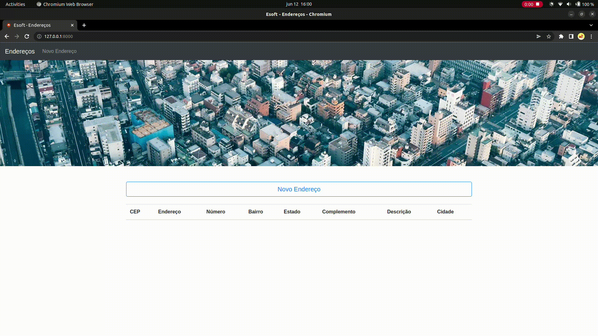

# Apresentação

Aplicação em Django para criar endereços.
Link para a aplicação hospedada no Heroku: https://welb-esoft.herokuapp.com/



# Instalação

1. Crie um ambiente virtual (recomendado):

```sh
	python3 -m venv venv
	. venv/bin/activate
```

2. Instale as dependências:

```sh
	pip install -r requirements.txt
```

3. Faça as migrações necessárias:

```sh
	python manage.py migrate
```

4. Inicie o servidor de desenvolvimento:

```sh
	python manage.py runserver
```

5. Navegue para o link http://localhost:8000
